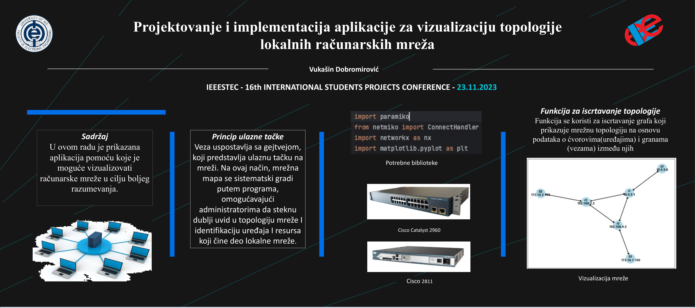

## Project Description

---

This project focuses on developing an application that visualizes the topology of local computer networks. The application is designed to help network administrators better understand and manage their networks by displaying the connections between devices within the network. Utilizing various libraries and technologies, the application collects information about network devices and their connections, and then graphically presents this data.




## Features

1. **Device Information Collection**: The application uses the SSH protocol to connect to network devices and gather data.
2. **Network Topology Discovery**: Utilizes Cisco Discovery Protocol (CDP) to identify neighboring devices.
3. **Network Visualization**: Displays the network topology using graphical libraries such as NetworkX and Matplotlib.

## Technologies

- **Python**: The primary programming language used for developing the application.
- **Paramiko**: A library for implementing the SSH protocol.
- **Netmiko**: A library for automating network devices.
- **NetworkX**: A library for analyzing and manipulating graphs and networks.
- **Matplotlib**: A library for data visualization.

## Installation

1. Clone the repository:
    
    ```bash
    bashCopy code
    git clone https://github.com/vukasin500/network-topology-visualization.git
    ```
    
2. Navigate to the project directory:
    
    ```bash
    bashCopy code
    cd network-topology-visualization
    ```
    
3. Install the required libraries:
    
    ```bash
    bashCopy code
    pip install -r requirements.txt
    ```
    

## Usage

1. Run the application:
    
    ```bash
    bashCopy code
    python main.py
    ```
    
2. Enter the username, password, and privileged mode password.
3. The application will automatically identify the gateway device and start scanning the network.
4. After the scan is complete, the application will display a graphical representation of the network topology.

## Project Structure

- `main.py`: Main script to run the application.
- `network_scanner.py`: Contains functions for network scanning and collecting device information.
- `visualization.py`: Contains functions for visualizing the network topology.
- `requirements.txt`: List of required libraries.

## Examples

### Example Console Output

```
plaintextCopy code
Device: R1
Neighbor: SW1, Interface: Gig0/1
Neighbor: SW2, Interface: Gig0/2

Device: SW1
Neighbor: R1, Interface: Gig0/1
Neighbor: PC1, Interface: Gig0/3

...

```

### Network Visualization

## Testing

The application has been tested on network devices in the Cisco lab at the Faculty of Electronic Engineering, University of Niš.

## Acknowledgements

The author thanks Prof. Dr. Vladimir Ćirić and Prof. Dr. Emilija Živanović for their mentorship and support, and the Cisco Academy for providing access to the laboratory.

## References

- [Cisco Networking Academy](https://www.netacad.com/)
- [Paramiko](https://pypi.org/project/paramiko/)
- [Netmiko](https://github.com/ktbyers/netmiko)
- NetworkX
- [Matplotlib](https://matplotlib.org/)


